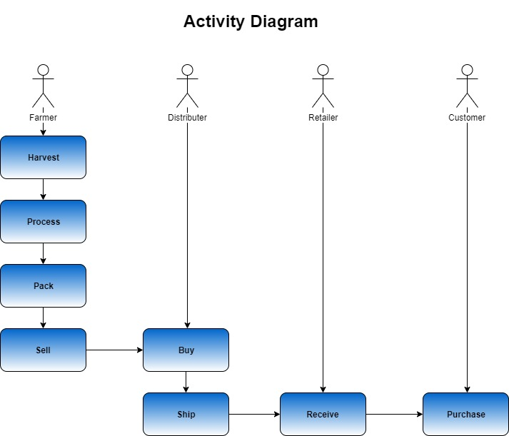
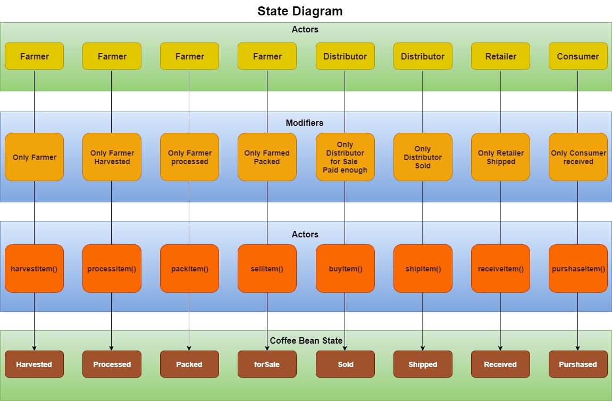
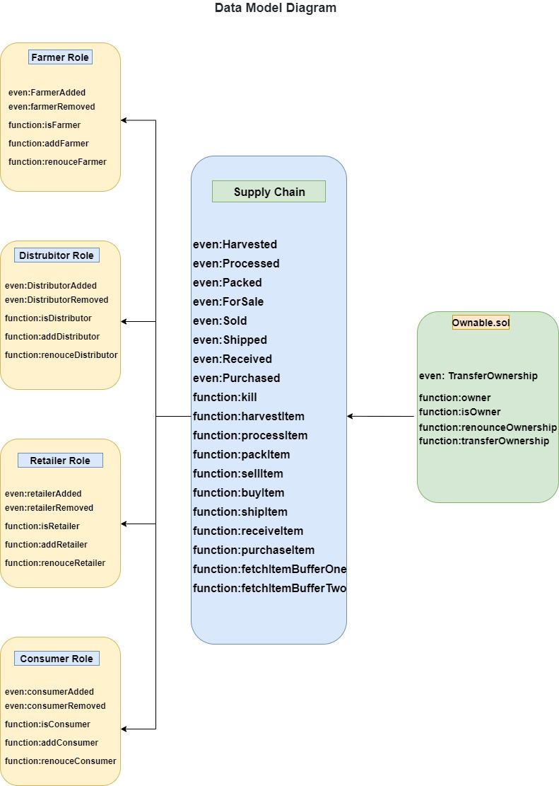

# Blockchain Developer Nanodegree project 3 (Supply chain )
This repository containts an Ethereum DApp that demonstrates a Supply Chain flow between a Seller and Buyer. The user story is similar to any commonly used supply chain process. A Seller can add items to the inventory system stored in the blockchain. A Buyer can purchase such items from the inventory system. Additionally a Seller can mark an item as Shipped, and similarly a Buyer can mark an item as Received.

## Project write-up - UML

### Activity


### Sequence


### State


### Classes (Data Model)


## Project write-up - Libraries
The `Roles` library was used by different access control contracts for easy add and remove in the supply chain 
`truffle-hd-wallet-provider` to sign transactions for addresses.

## IPFS
IPFS is not used in this project

## Program Versions numbers
Node: v10.15.3
Solidity: v0.4.24
Truffle: v5.0.25
Web3.js: v1.0.0-beta37 

## Contract address on the Rinkeby test network (Etherscan):
https://rinkeby.etherscan.io/address/0x1d4396d3dfdfffb57e2ae580f175e7dfcf08759a

## Transaction ID and contract address

======================
> Network name:    'rinkeby'
> Network id:      4
> Block gas limit: 0x989677


1_initial_migration.js
======================

   Deploying 'Migrations'
   ----------------------
   > transaction hash:    0x1a02bb12fc80417e2ad1bd56250775110126d74e48fbb03041ae98b24ff92052
   > Blocks: 1            Seconds: 21
   > contract address:    0x302cfAe2e65F6651f3fDB5fAe6f635ca62CA567b
   > block number:        5625069
   > block timestamp:     1576515319
   > account:             0x1D4396D3DfdFFFB57e2Ae580f175E7DFCf08759A
   > balance:             0.97167573
   > gas used:            238594
   > gas price:           10 gwei
   > value sent:          0 ETH
   > total cost:          0.00238594 ETH


   > Saving migration to chain.
   > Saving artifacts
   -------------------------------------
   > Total cost:          0.00238594 ETH


2_deploy_contracts.js
=====================

   Deploying 'FarmerRole'
   ----------------------
   > transaction hash:    0x79b84bba9672baeb0181fa97016e03510903903052a19f4a4a6f0168627ef9ca
   > Blocks: 1            Seconds: 12
   > contract address:    0xa041c902B5E6a8a83c9A3cf6D55C65183eb2462f
   > block number:        5625071
   > block timestamp:     1576515349
   > account:             0x1D4396D3DfdFFFB57e2Ae580f175E7DFCf08759A
   > balance:             0.96674205
   > gas used:            451020
   > gas price:           10 gwei
   > value sent:          0 ETH
   > total cost:          0.0045102 ETH


   Deploying 'DistributorRole'
   ---------------------------
   > transaction hash:    0xf245353475ad170ce060d54680cb2003f8abf9ecdef52db245791b3ca9f79b41
   > Blocks: 0            Seconds: 9
   > contract address:    0xaf1624F9BA8972070eE42311684BE921000355b1
   > block number:        5625072
   > block timestamp:     1576515364
   > account:             0x1D4396D3DfdFFFB57e2Ae580f175E7DFCf08759A
   > balance:             0.96223113
   > gas used:            451092
   > gas price:           10 gwei
   > value sent:          0 ETH
   > total cost:          0.00451092 ETH


   Deploying 'RetailerRole'
   ------------------------
   > transaction hash:    0xec3342fef968e5791df950cf6e1ba8b037d348b11f26e8f5a58f2cb41e6523fe
   > Blocks: 0            Seconds: 9
   > contract address:    0xaf4Cb7bb1ED23FA76f18E34261BE81584Bc6c792
   > block number:        5625073
   > block timestamp:     1576515379
   > account:             0x1D4396D3DfdFFFB57e2Ae580f175E7DFCf08759A
   > balance:             0.95772033
   > gas used:            451080
   > gas price:           10 gwei
   > value sent:          0 ETH
   > total cost:          0.0045108 ETH


   Deploying 'ConsumerRole'
   ------------------------
   > transaction hash:    0x0346a0f1176aacbc2f70d695d25d3ff0bc2b2c5b7b29257e530a3c63510a595a
   > Blocks: 0            Seconds: 7
   > contract address:    0x59Fb032D660d3830Ec24729D6A57286c8Cef0dd8
   > block number:        5625074
   > block timestamp:     1576515394
   > account:             0x1D4396D3DfdFFFB57e2Ae580f175E7DFCf08759A
   > balance:             0.95320977
   > gas used:            451056
   > gas price:           10 gwei
   > value sent:          0 ETH
   > total cost:          0.00451056 ETH


   Deploying 'SupplyChain'
   -----------------------
   > transaction hash:    0x33d25ff003526fa072304b4fcb2921d8e160c37b3cd70292d6a842cf6cecbb49
   > Blocks: 1            Seconds: 10
   > contract address:    0x66c0486577009EC26A9429B1E38657Ba0fa5c2B0
   > block number:        5625075
   > block timestamp:     1576515409
   > account:             0x1D4396D3DfdFFFB57e2Ae580f175E7DFCf08759A
   > balance:             0.92025103
   > gas used:            3295874
   > gas price:           10 gwei
   > value sent:          0 ETH
   > total cost:          0.03295874 ETH


   > Saving migration to chain.
   > Saving artifacts
   -------------------------------------
   > Total cost:          0.05100122 ETH


Summary
=======
> Total deployments:   6
> Final cost:          0.05338716 ETH

## Getting Started

These instructions will get you a copy of the project up and running on your local machine for development and testing purposes. See deployment for notes on how to deploy the project on a live system.

### Prerequisites

Please make sure you've already installed ganache-cli, Truffle and enabled MetaMask extension in your browser.

```
Give examples (to be clarified)
```

### Installing

A step by step series of examples that tell you have to get a development env running

Clone this repository:

```
git clone https://github.com/udacity/nd1309/tree/master/course-5/project-6
```

Change directory to ```project-6``` folder and install all requisite npm packages (as listed in ```package.json```):

```
cd project-6
npm install
```

Launch Ganache:

```
ganache-cli -m "spirit supply whale amount human item harsh scare congress discover talent hamster"
```

Your terminal should look something like this:


In a separate terminal window, Compile smart contracts:

```
truffle compile
```

Your terminal should look something like this:


This will create the smart contract artifacts in folder ```build\contracts```.

Migrate smart contracts to the locally running blockchain, ganache-cli:

```
truffle migrate
```

Your terminal should look something like this:


Test smart contracts:

```
truffle test
```

All 10 tests should pass.


In a separate terminal window, launch the DApp:

```
npm run dev
```

## Built With

* [Ethereum](https://www.ethereum.org/) - Ethereum is a decentralized platform that runs smart contracts
* [IPFS](https://ipfs.io/) - IPFS is the Distributed Web | A peer-to-peer hypermedia protocol
to make the web faster, safer, and more open.
* [Truffle Framework](http://truffleframework.com/) - Truffle is the most popular development framework for Ethereum with a mission to make your life a whole lot easier.


## Authors

See also the list of [contributors](https://github.com/your/project/contributors.md) who participated in this project.

## Acknowledgments

* Solidity
* Ganache-cli
* Truffle
* IPFS


